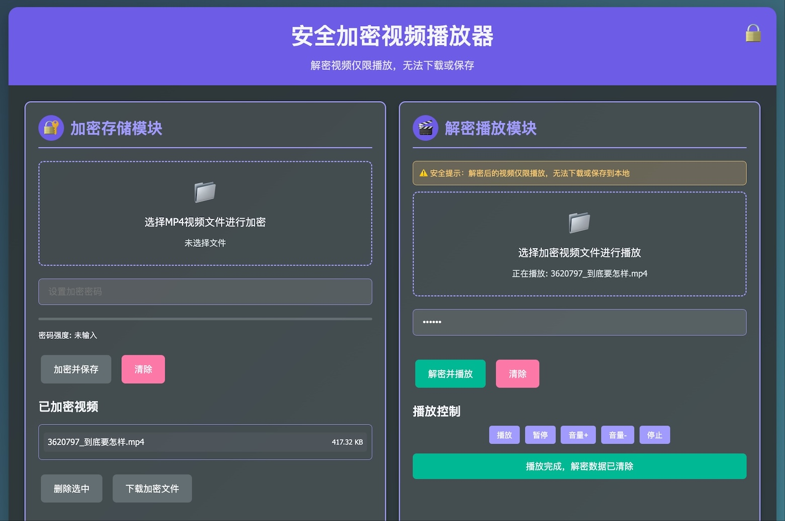

# 安全加密视频播放器


## 项目简介

安全加密视频播放器是一个跨平台的桌面应用程序，提供视频文件的加密存储和安全播放功能。它使用强大的加密算法保护您的视频内容，确保只有授权用户才能观看，同时防止未经授权的下载和分发。

## 预览



## 功能特点

- 🔒 **安全加密**: 使用AES-256-CBC算法加密MP4视频文件
- ▶️ **安全播放**: 解密后的视频仅在内存中播放，无法下载或保存
- 📁 **文件管理**: 内置加密文件管理系统，支持删除和下载加密文件
- 🎛️ **播放控制**: 提供完整的视频播放控制功能
- 🔐 **密码强度检测**: 实时显示加密密码强度
- 🌐 **跨平台**: 支持Windows、macOS和Linux系统
- 💾 **本地存储**: 使用IndexedDB(Web版)或本地文件系统(桌面版)存储加密文件

## 技术栈

- **前端**: HTML5, CSS3, JavaScript (ES6+)
- **桌面框架**: Electron
- **加密算法**: Web Crypto API (浏览器) / Node.js Crypto (桌面)
- **样式**: Bootstrap (可选) 或 自定义CSS
- **存储**: IndexedDB (浏览器) / 本地文件系统 (桌面)

## 安装与使用

### Web版本

1. 直接打开 `index.html` 或 `index-bootstrap.html` 在浏览器中运行
2. 无需安装，支持现代浏览器(Chrome, Firefox, Edge等)

### 桌面版本 (Electron)

1. 确保已安装 Node.js (v14+)
2. 克隆或下载项目文件
3. 在项目目录中运行:
   ```bash
   npm install
   npm start
   ```

### 构建可执行文件

```bash
npm run build
```

构建后的应用程序将位于 `dist` 目录中。

## 使用指南

### 加密视频

1. 点击"选择MP4视频文件"按钮选择要加密的视频
2. 设置一个强密码(建议12位以上)
3. 点击"加密并保存"按钮
4. 加密后的文件将保存在本地存储中

### 播放加密视频

1. 在已加密视频列表中选择文件或上传加密文件(.encrypted)
2. 输入正确的解密密码
3. 点击"解密并播放"按钮
4. 视频将在安全播放器中播放，无法下载

### 文件管理

- **下载加密文件**: 可以下载加密后的文件进行备份或传输
- **删除加密文件**: 从存储中永久删除选中的加密文件

## 技术架构

### 加密模块
使用AES-256-CBC算法进行加密，每个文件使用随机初始向量(IV)，确保相同内容不同加密结果。

### 安全播放机制
- 解密数据仅存在于内存中
- 禁用视频右键菜单和下载功能
- 播放结束后自动清除解密数据
- 使用Blob URL进行安全播放

### 数据存储
- **Web版**: 使用IndexedDB存储加密文件和相关元数据
- **桌面版**: 使用本地文件系统存储加密文件(.encrypted)

## 安全性说明

### 已实现的安全措施
1. 使用强加密算法(AES-256-CBC)
2. 解密数据不写入磁盘
3. 禁用视频下载功能
4. 播放结束后自动清理内存
5. 防止右键菜单访问视频选项

### 注意事项
1. 加密强度取决于密码复杂度
2. 应用程序本身是开源的，可审查代码安全性
3. 建议使用强密码并定期更换

## 开发指南

### 项目结构
```
crypto-player/
├── index.html              # 主页面(自定义样式)
├── index-bootstrap.html    # Bootstrap样式版本
├── main.js                 # Electron主进程
├── package.json            # 项目配置和依赖
└── README.md              # 项目说明文档
```

### 扩展功能建议
- 添加多因素认证
- 实现视频水印功能
- 增加播放次数或时间限制
- 添加云端备份功能
- 支持更多视频格式

## 许可证

本项目采用 MIT 许可证 - 查看 [LICENSE](LICENSE) 文件了解详情。

## 贡献指南

欢迎提交Issue和Pull Request来帮助改进这个项目。

1. Fork 本项目
2. 创建特性分支 (`git checkout -b feature/AmazingFeature`)
3. 提交更改 (`git commit -m 'Add some AmazingFeature'`)
4. 推送到分支 (`git push origin feature/AmazingFeature`)
5. 开启Pull Request

## 常见问题

**Q: 忘记密码怎么办？**
A: 加密视频无法在没有密码的情况下解密，请妥善保管密码。

**Q: 支持哪些视频格式？**
A: 目前主要支持MP4格式的视频文件。

**Q: 加密文件可以跨设备使用吗？**
A: 可以，您需要导出加密文件并在其他设备上导入。

**Q: 最大支持多大的视频文件？**
A: 理论上没有限制，但极大文件可能会影响加解密性能。

## 支持

如果您遇到问题或有建议，请通过以下方式联系：
- 提交GitHub Issue
- 发送邮件至: [xuebusi@qq.com]
